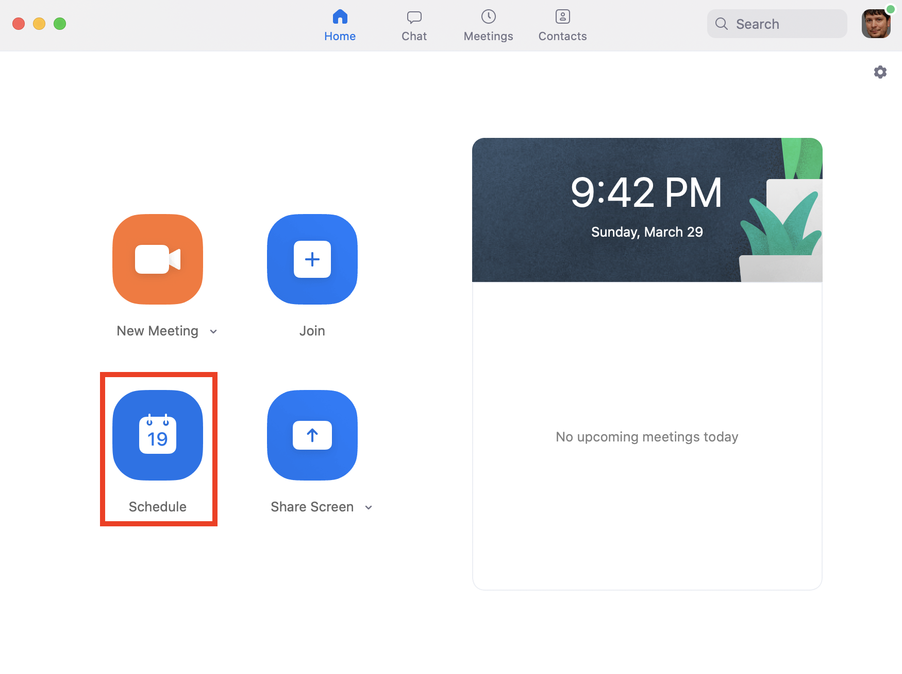
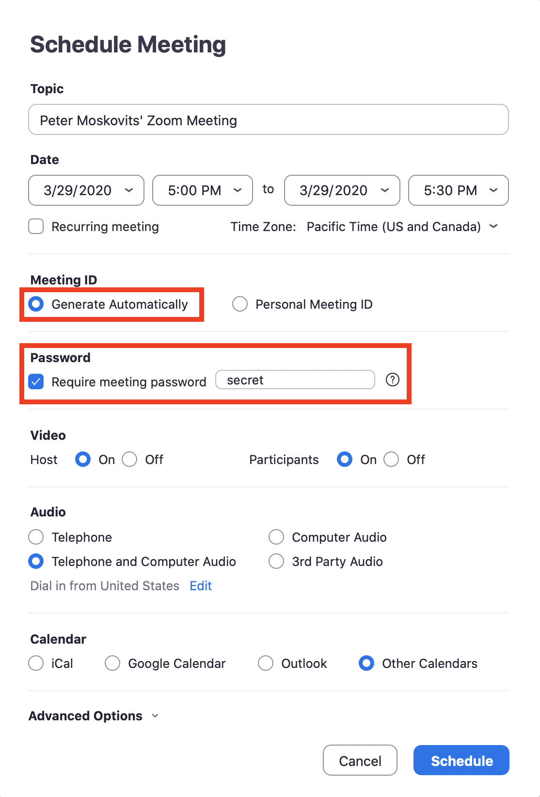
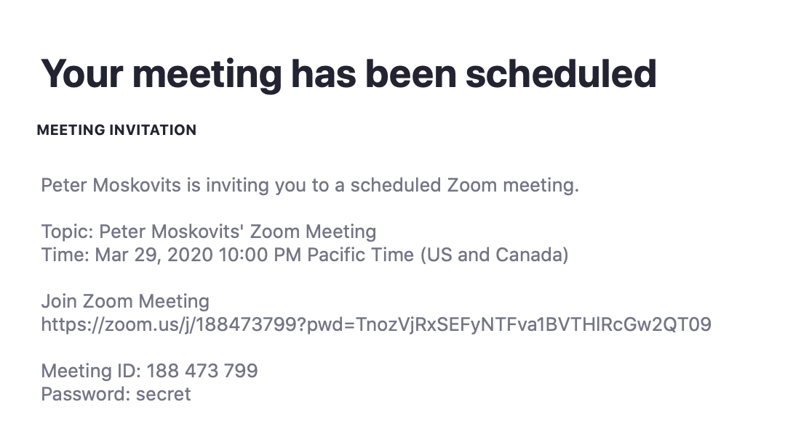
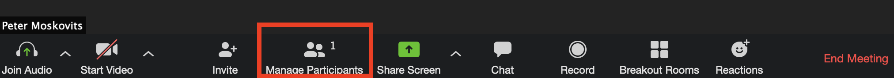
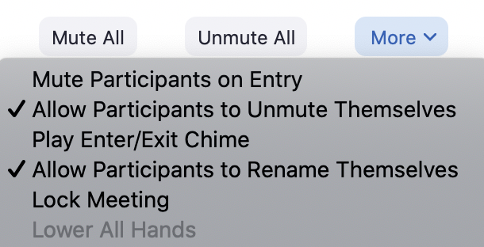

With the increased popularity of <a href="https://zoom.us">Zoom</a>, it's more important than ever to ensure only those, who are invited can attend your meetings and classes. Here are the tools everybody has to be aware of to prevent "zoombombing".

<h2>Scheduling the meeting</h2>

The first, and most important tool you should be using is <i>scheduling your Zoom calls</i>. When you schedule your Zoom meetings ahead of time, you have the ability to request Zoom to generate a unique meeting ID for you. This will make it very hard for trolls to guess your meeting URL. After the unique URL is generated for you, you will have to share it with your class/meeting attendees.

If you want to notch security up a level, you can also create a password for your meetings. For confidential meetings, or classes especially with young children, this is definitely something you should consider using.

To schedule your meeting, select <i>Schedule</i> from your Zoom app.

Be sure you select <i>Generater Automatically</i> under <i>Meeting ID</i>, and optionally <i>Require meeting password</i>

As mentioned earlier, in order for this to work, you'll have to share the Zoom meeting information with your class or attendees. The best option to do so is sending a calendar invitation. I like to send my calendar invites myself, so I tend to select <i>Other Calendars</i>, and set up the calendar invitation myself.

<b>Pro Tip</b>: One more important thing to note about the meeting that was scheduled for you is that your attendees can join the meeting either by clicking the long URL Zoom generates for you, in our case: <tt>https://zoom.us/j/188473799?pwd=TnozVjRxSEFyNTFva1BVTHlRcGw2QT09</tt>. The alternative is them entering the meeting ID <tt>188473799</tt>, and when prompted, enter the meeting password <tt>secret</tt>.

<h2>After starting the meeting</h2>

Once your meeting is running you have a few additional options you can use. Select <i>Manage Participants</i>, and click <i>More</i> in the <b>Participants</b> dialog.

The options are pretty self-explanatory and good to know about. From a security perspective the most important of all is <i>Lock Meeting</i>. This option will prevent new attendees to join until you explicitly unlock the meeting - even if they know the meeting ID and the password.

Let me know in the comments if there are any other security options you're using for your meetings or classes.
