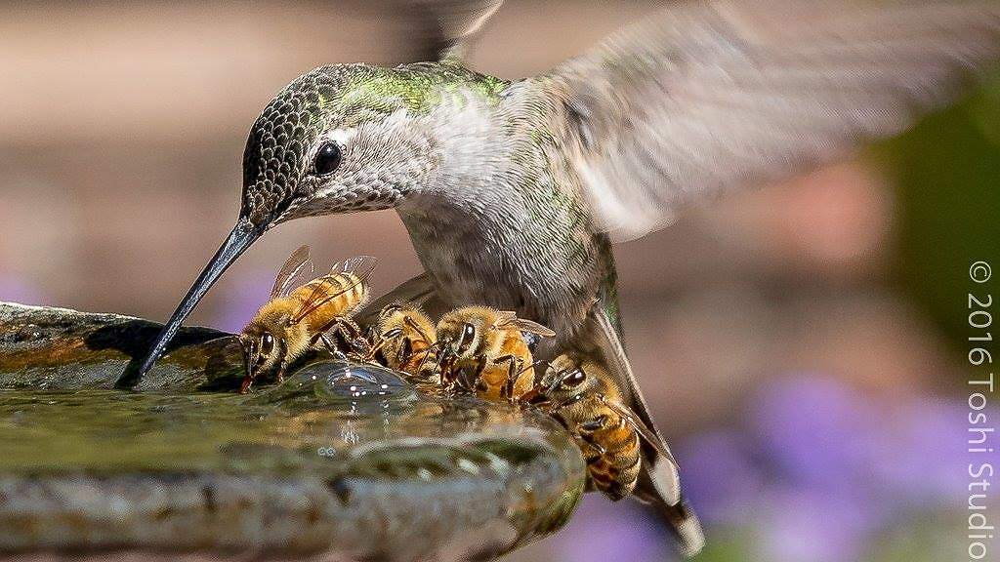
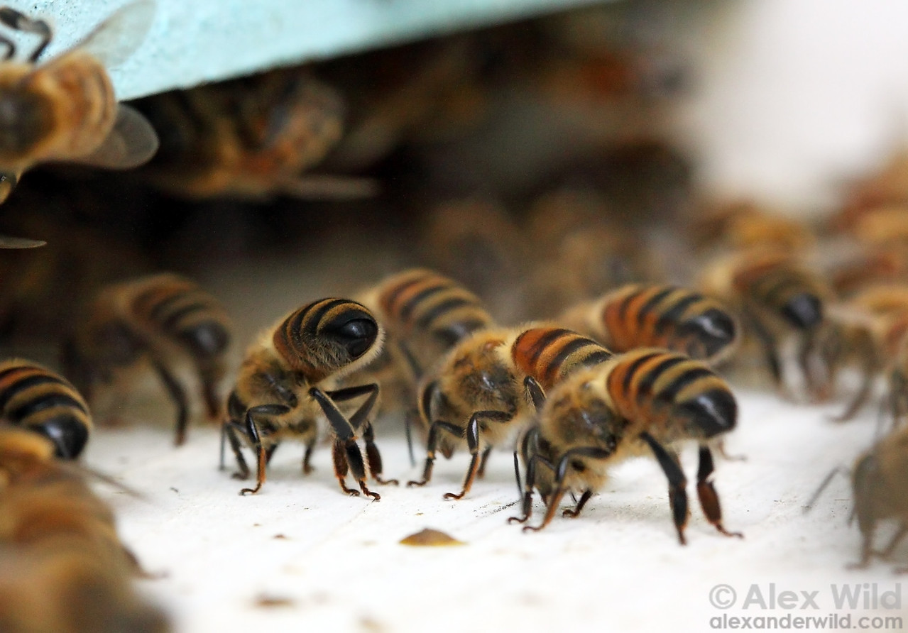
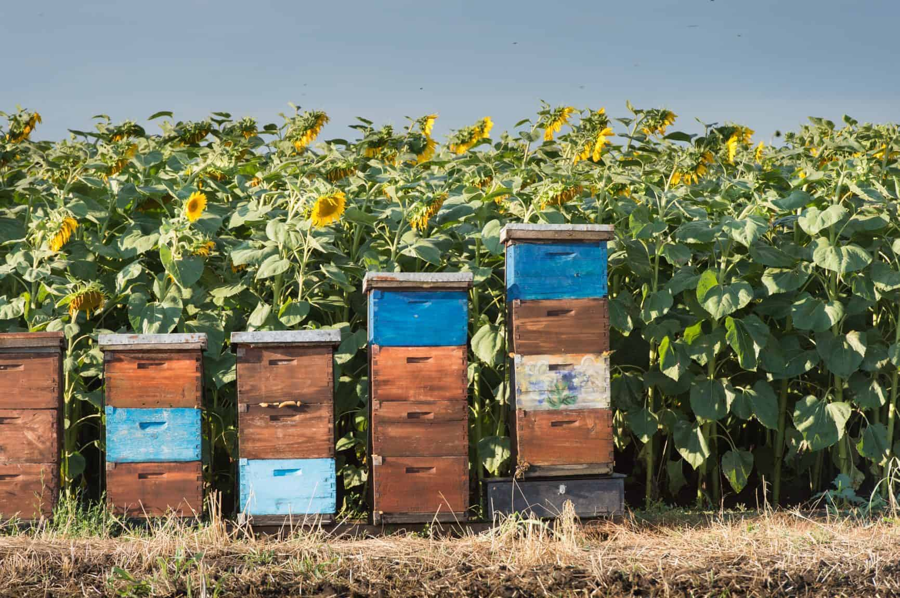
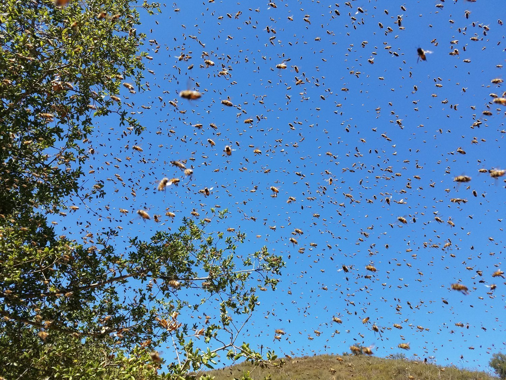

Unlike the overwhelming majority of other animals, bees can not function, survive and reproduce as individuals. There's a critical minimum number of individuals needed for survival. Bees form a superorganism and are working together in surprisingly sophisticated ways, allowing them to achieve truly magical things. The creativity of evolution is often way beyond our own human creativity.

<b>superorganism</b> [sü-pər-ˈȯr-gə-ˌni-zəm]

Noun

Biology

<pre>
A group or association of organisms which behaves
in some respect like a single organism; a complex
system consisting of a large number of organisms
which itself behaves as if it were an organic whole,
as human society, an ecosystem, etc.
</pre>

One can liken the cooperative behavior of bees to multi-cell organizations. Just like there's an evolutionary advantage that complex, multi-cellular organisms have over single cell organisms, cooperating insects can solve very complex problem in a much more sophisticated fashion than individuals can.

Let's take a look at some examples for a honey bee colony to behave like a single organism? We'll review the following:
<ul>
  <li>
    Temperature control: heating
  </li>
  <li>
    Temperature control: cooling
  </li>
  <li>
    Ventilation
  </li>
  <li>
    Fever
  </li>  
  <li>
    Locomotion
  </li>  
</ul>

<h3>Temperature control: heating</h3>  

The core of the honey bee colony, the brood chamber, is kept between 34C and 36C (93F-96F), even as outside temperature is extremely cold or extremely hot; between -30C & 50C (-20F to 120F). Bees adjust the temperature of the hive by adjusting their metabolism, fueled by honey.

In the winter bees can heat very efficiently. Only a small subset of the colony is heating. A colony of 2kg generates about 40W (the equivalent of a small incandescent light bulb).

In continental climates honey bee colonies burn about 20kg honey during winter. To collect this much honey, it takes about 1 million foraging trips by a colony’s workers.

<h3>Temperature control: cooling</h3>  
On hot days, workers carry water to the hive that they evaporate to prevent the brood from overheating.

<b>Note</b>: As beekeepers, it's our responsibility to ensure bees have water. Bees are not picky when it comes to water - muddy water is just as fine for them as a fresh spring.

<h3>Ventilation</h3>
When the CO2 level increases in the hive by 1%-2%, bees increase ventilation by fanning at the hive entrance.

<h3>Fever</h3>  

In case of fungal infection, for example, the colony has the ability to fight it by colonial fever, by increasing the hive's temperature.

<h3>Locomotion</h3>  
During a swarm, tens of thousands of bees leave the hive, and are flying as one unit.

<h3>Other superorganisms</h3>

And just for the record, honey bees are not the only insects forming superorganisms: <a href="https://en.wikipedia.org/wiki/Leafcutter_ant">leafcutter ants</a> form huge and incredibly complex societies as well.

