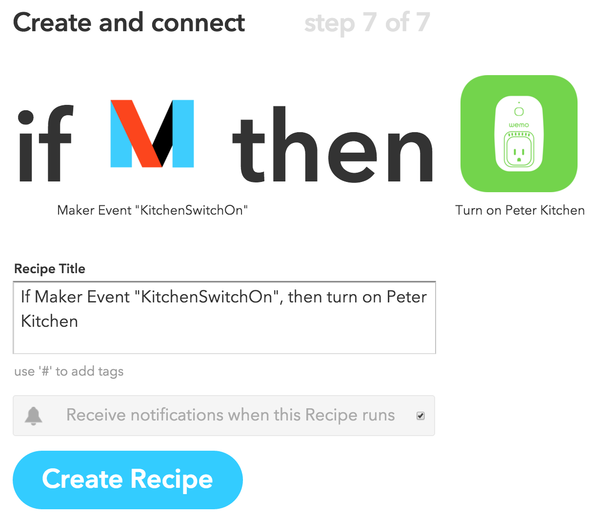

<h1>Building Cognitive Real-Time IoT Solutions Like LEGOs</h1>
<h2>Voice Controlled Lights Over the Web</h2>
<h3>Introduction</h3>

**Note**: See source in <a href="https://github.com/pmoskovi/homeiot">github repo</a>.

This example demonstrates how you can control physical devices through natural voice commands over the Web in real time. For the physical device I used a reading lamp, but as you'll see, it can be any electric device, really.

In my simple scenario I control the lights in 4 rooms of a house.
I use a Web app on my computer to give free form voice commands (it could be a mobile app just as easily). The voice command is then converted to text in the cloud by IBM's cognitive engine, Watson. After processing the text, I identify the action(s) that need(s) to be taken. The action is then submitted to control the lights, and is published to the monitoring clients for real-time monitoring.

Let's cut to the chase and watch what it all looks like:

<iframe width="700" height="380" src="https://www.youtube.com/embed/CaxVSgmtYtU" frameborder="0" allowfullscreen></iframe>
<h2>Behind the Scenes</h2>


To make this demonstration happen, I used the <a href="https://www.ibm.com/smarterplanet/us/en/ibmwatson/developercloud/speech-to-text.html">IBM Watson speech-to-text Bluemix service</a>, <a href="http://kaazing.com">AMQP over WebSocket from Kaazing</a> for event-driven real-time monitoring, and the <a href="http://www.belkin.com/us/p/P-F7C027/">Belkin WeMo Switch</a> in conjunction with <a href="http://ifttt.com">IFTTT</a> for controlling the switch remotely.

Here's the high-level overview of most of the moving pieces (without monitoring):


When I press the "talk" button in the browser window, the red light comes on, indicating that recording is in progress. The voice data is streamed over a WebSocket connection to the <a href="https://www.ibm.com/smarterplanet/us/en/ibmwatson/developercloud/speech-to-text.html">IBM Bluemix Watson speech-to-text service</a>, and the resulting string is returned to the browser, displayed under the red light.


Once the action is figured out, the client recording the human voice publishes it both to the <a href="http://wemo.com">Belkin WeMo</a> device(s), and to the monitoring client(s). The former is performed in the form of HTTP REST calls through <a href="http://iftt.com">IFTTT</a>, the latter as WebSocket messages over AMQP pub/sub, using the cloud-hosted AMQP WebSocket server by <a href="Kaazing">http://kaazing.com</a>.

**Note**: If we were building this for real, it would probably be the Node handling the monitoring-related messages. For this example, publishing from the client browser is just as good...

Here's the complete diagram, this time with the real-time monitoring included as well:


The WebSocket connections, marked as WSS on the diagrams above for WebSocket Secure, are long lasting full-duplex connections, supporting low-latency streaming of data.

To see how straight-forward it is to integrate Watson Text-to-Speech, event-driven pub/sub communication over WebSocket, how you can connect the Belkin WeMo light switch along with latency characteristics, keep reading...

<h2>Getting Hands-On</h2>
<h3>Watson Speech-to-Text</h3>

**Note**: See source in <a href="https://github.com/pmoskovi/homeiot">github repo</a>.

To run this demo, you have to acquire Bluemix service credentials for the <a href="https://www.ibm.com/smarterplanet/us/en/ibmwatson/developercloud/speech-to-text.html">Watson Speech2Text service</a>. To do so, sign in to (or sign up for) Bluemix (free trial account), locate the Watson Speech2Text service, and select Add Credentials.


The best way to learn more about the Watson Speech-to-Text service is by checking out this <a href="https://speech-to-text-demo.mybluemix.net/">pretty incredible demo</a>.

This demo is based on the <a href="https://github.com/watson-developer-cloud/speech-javascript-sdk">Watson Javascript Speech SDK</a>.

Here's the snippet from the node code responsible for getting a hold of the Bluemix credentials through the environment variables, needed for the JavaScript client to stream the sound to Watson for processing.

```
if (!process.env.WATSON_BLUEMIX_UN) {
  console.log ('Environment variable WATSON_BLUEMIX_UN is undefined.');
  console.log ('If you don\'t have one, sign up for an account on http://bluemix.net.');
} else
if (!process.env.WATSON_BLUEMIX_PW) {
  console.log ('Environment variable WATSON_BLUEMIX_PW is undefined.');
  console.log ('If you don\'t have one, sign up for an account on http://bluemix.net.');
} else
{
  // For local development, replace username and password
  var config = extend({
      version: 'v1',
      url: 'https://stream.watsonplatform.net/speech-to-text/api',
      // Be sure to set environment variables before running node server
      // E.g.: export WATSON_BLUEMIX_UN=joe
      username: process.env.WATSON_BLUEMIX_UN,
      password: process.env.WATSON_BLUEMIX_PW,
  }, vcapServices.getCredentials('speech_to_text'));
```

And this is the JavaScript code running in the browser, leveraging the <a href="https://github.com/watson-developer-cloud/speech-javascript-sdk">Watson Javascript Speech SDK</a>:

```
var recordSpeech = function() {
  $.get('/token').then(function (token) {
    stream = WatsonSpeechToText.stream({
        token: token
    });
    redlight.src="img/redlighton.png";

    // each result (sentence) gets it's own <span> because Watson will sometimes go back and change a word as it hears more context
    // var $curSentence = $('<span>&nbsp;</span>').appendTo($output);
    var curSentence='';
    // a result is approximately equivalent to a sentence
    stream.on('result', function(result) {
        // update the text for the current sentence with the default alternative.
        // there may be multiple alternatives but this example app ignores all but the first.
        curSentence = result.alternatives[0].transcript;
        $('#watsonText').text(curSentence);
        if (result.final) {
          // if we have the final text for that sentence, start a new one
          processText(curSentence);
          redrawHouse(canvas, context);
          sendMessage();
          consoleLog ("Final sentence: " + curSentence);
        }
    });

    stream.on('error', function(err) {
        consoleLog(err);
    });

  });
};
```

<h3>Event-driven Real-time Communication Using AMQP Pub/Sub Over WebSocket</h3>

The communication between the controller browser and the monitoring browser takes place through a permanent WebSocket connection. For this experiment, I used <a href="https://github.com/kaazing/universal-client">Kaazing's universal client</a>, and selected AMQP 0-9-1 as the pub/sub protocol on top. The beauty of Kaazing is that you can use pub/sub over the web as if you were behind the enterprise firewall. Kaazing takes the web out of your way.

**Note:** The two APIs/protocols Kaazing currently offers as part of their universal client implementation is AMQP and JMS. I picked AMQP, as Kaazing hosts a publicly available pretty much unlimited AMQP service for general consumption (but not a JMS one).


Kaazing hosts a freely available server that they call *sandbox*. The URL to access their service is: `wss://sandbox.kaazing.net/amqp091`. To try it out, take a look at the <a href="http://kaazing.org/demos/ampq091-messaging-javascript">JavaScript AMQP messaging example</a>.

**Shameless plug**: If you want to learn more about the WebSocket technology, protocol layering, pub/sub and more, check out my book, <a href="http://petermoskovits.com/posts/websocket-book.html">The Definitive Guide to HTML5 WebSocket</a>.

<a href="http://petermoskovits.com/posts/websocket-book.html"></a>

<h4>About the AMQP/WebSocket Code</h4>

Let's take a brief look at how the event-driven communication takes place between the browser clients.
Upon successful loading of the HTML document, the browser connects to the WebSocket server:

```
client.connect(url, username, password, topicP, topicS, noLocal, handleMessage, handleWebSocketError, logWebSocketMessage, onWebSocketConnected);
```

The last four parameters in the above `client.connect()` are callback functions invoked when a new message arrives, an error occurs, logging is needed, and the WebSocket connection has been established, respectively.

As an example, here's what `onWebSocketConnected()` looks like. It initializes the

```
var onWebSocketConnected = function () {
  initHome();
};
```

The value of the other parameters looks as follows:

```javascript
// WebSocket connection info
var url = 'wss://sandbox.kaazing.net/amqp091';
var username = 'guest';
var password = 'guest';
var topicP = 'demo_exchange';
var topicS = 'demo_exchange';
var noLocal = true;
var client = UniversalClientDef('amqp');
```

To send messages, the `client.sendMessage(msg)` function has to be invoked. The purpose of this call is to inform all the interested (monitoring) clients about the latest state of the lights in our home.

<h3>Controlling Light with WeMo & IFTTT</h3>

To control the light by switching it on and off, you can use IFTTT. They provide a long list of triggering actions. The Maker channel being the most exciting, allowing you to invoke simple REST calls. Here are the two recipes I use for the kitchen light in this demo:


And here's how you define the triggers and their actions:


The two URLs to trigger the action look like this:

'''https://maker.ifttt.com/trigger/KitchenSwitchOff/with/key/<your key>'''

If you want to test it from the command line, here's the curl command for your convenience:

'''curl -X POST https://maker.ifttt.com/trigger/KitchenSwitchOff/with/key/<your key>'''


To connect the Wemo Switch to IFTTT, you have to walk through the following steps:

1. **Choose Trigger Channel**: select Maker. The Maker channel allows you to use an HTTP/REST call to trigger the switch event.
<br/>


2. **Choose a Trigger**: As we picked Maker in Step 1., here the only option available to us is **Receive a web request**.
<br/>


3. **Complete Trigger Fields**: Here we have to provide a name for the event. For us it makes sense to include the name of the room, and whether we switch the light On or Off. For example: KitchenSwitchOn
<br/>


4. **Choose Action Channel**: We got to the triggered event part. Here, by searching for *wemo*, you get to see all the Belkin WeMo devices. I use the WeMo Switch, highlighted in the picture.
<br/>


5. **Choose an Action**: For the WeMo Switch there are 5 actions to choose from: turn on, turn off, turn on then off, turn off then on, and toggle on/off. As we'll send explicit on/off messages to our device, we select *Turn on* for the KitchenSwitchOn event.
<br/>


6. **Complete Action Fields**: In this step we have to select which switch we want to activate. I named my switch *Peter Kitchen*.
<br/>


7. **Create and connect**: Confirm the title of the recipe, and click *Create Recipe*.
<br/>


<h4>Connecting the IFTTT Maker Channel with a REST Call</h4>
During the creation of the IFTTT recipe, IFTTT doesn't give you the URL you need to invoke to trigger the action. To get the URL, point your browser to ```https://ifttt.com/maker```.

<h4>The latency of controlling the WeMo Switch</h4>
As you can see in the recording above, the monitoring dashboard and the control screen keep in sync with amazing accuracy. Kaazing made their name in the industry by providing virtually unlimited horizontal scale, while keeping the latency to an absolute minimum.

When it comes to controlling the light, the picture is a quite different.

From a network connectivity perspective there are 3 ways to control your WeMo Switch. The method you use affect the latency big time.

* _**WeMo mobile app**, while **on the same LAN/WiFi**_: The latency is not noticeable, it feels real-time. My feel is that it's in the 100-200ms range.
* _**WeMo mobile app**, remotely **through the public Web/cloud**_: For this test I connected my phone through a different WiFi. The control request goes out to the Belkin cloud first, and then comes back into the house. The latency is in the ballpark of 1-2 seconds.
* _**REST call**, through **IFTTT Maker Channel**_: When invoking the URLs above, the latency is in the 5-10 second range. It's hard to tell whether the latency is introduced on the Belkin side or by IFTTT, but it's very noticeable. This is the one you see in the video above.

<h4>Miscellaneous</h4>

<h5>Resetting the WeMo Switch to Factory Defaults</h5>
As I was playing with the router settings of the WeMo Switch, it turned out the biggest challenge was resetting it to factory defaults. The instructions are talking about the reset button, but it took me a looong time to realize that the reset button is well hidden on the top (or bottom, depending on how your 110V socket is installed) of the device.

Even after a successful reset, connecting to the WiFi router has been a painful (and repetitive) experience. Users are complaining about it in the forums quite a bit.

<h5>Personal Hotspot as the WiFi router for WeMo</h5>
Also, I tried it hard, really hard, to get the WeMo to connect to my iPhone's Personal Hotspot WiFi, but no luck. Since I use the WeMo quite a bit on the go while I do demos, I ended up connecting it to my (T-)mobile hotspot.

## Docker commands

As part of this exercise, I've deployed the node code to Docker as a microservice as well. Here are the commands. The username and password are set as environment variables, and picked up by the docker run command:

```
$> docker run -p 8001:3001 -e "WATSON_BLUEMIX_UN=<your_un>" -e "WATSON_BLUEMIX_PW=<your_pw>"  pmoskovi/homeiot
```

E.g.:

```
$> docker run -p 8001:3001 -e "WATSON_BLUEMIX_UN=9b6f1d7f-93fd-4901-8178-c02fc1b52083" -e "WATSON_BLUEMIX_PW=CsNg1PiQzz0x"  pmoskovi/homeiot
```
Be sure to use the _IP address assigned to your VirtualBox VM_, the _port_ specified above (8001 in our example), as well as _https_ as the protocol in the address bar.

If you're not sure what your IP address is, run the following command:
```
$> docker-machine ip default
192.168.99.100
```
**https://192.168.99.100:8001**

The command that was used to build the Docker image:

```
$> docker build -t pmoskovi/homeiot .
```

**Technologies used:**

- [IBM Watson speech-to-text Bluemix service](https://console.ng.bluemix.net/catalog/services/speech-to-text)
- Kaazing
 - [WebSocket cloud service - AMQP](http://kaazing.org/blog/public-websocket-sandbox/)
 - [Kaazing WebSocket Gateway Unified Client](https://github.com/kaazing/universal-client) - AMQP 0-9-1: for real-time pub/sub communication over WebSocket
- [Belkin WeMo Switch](http://www.belkin.com/us/p/P-F7C027/)
- [IFTTT - If This Than That](http://ifttt.com/)
- Node.js
- Docker

<h2>Technical Challenges Along the Way</h2>
<h3>Microphone Access</h3>
I wanted to make this example as generic as possible, so the client controlling the light, as well as the monitoring experience are all Web clients. As a result of (or despite) it, I ran into a handful of challenges along the way.

<h4>No Access to Microphone from Mobile Safari</h4>
<a href="http://mobilehtml5.org/">Safari on iOS</a> doesn't support `getUserMedia()`, thus HTML5 apps have no access to the microphone. The part of the demo requiring microphone has to be run from a desktop browser, e.g. Chrome.

<h4>Google Chrome Microphone Access over HTTPS only</h4>
<a href="https://developers.google.com/web/updates/2015/10/chrome-47-webrtc?hl=en">As of Chrome 47</a>, `getUserMedia()` requests are only allowed from secure origins: HTTPS or localhost. Therefore, for this demonstration to work, we use a self-signed certificate, located in the `/keys` directory. As a result, in Chrome, you'll have to step through the certificate-related warnings. Warnings like this are reason for caution when seen out there in the wild west, but here it simply indicates that the certificate wasn't signed by one of the certificate authorities known to the browser:


